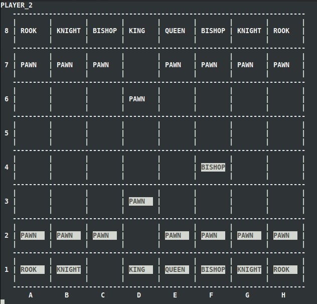

# Terminal Chess
A simple chess game for the terminal

##About
This program is written with Ada2012 and requires a Ada2012 GNAT compiler. Also required is an installation of ncurse-dev for your version GCC.

The current flags are

    -l - sets to a local(one machine) game. This is the default behavior, if not specified.
    -n - sets to a network game between two computers. This requires the following flags to be specified.
    -h - specify if the computer is a host. If not specified, default is not the host. 
    -p: - Port number
    -i: - IP address of the host. NOTE: This function is not working in the current version. To change the IP address manipulating the IP address in the main file (chess.adb) is required.
   
##Examples

    ./chess -l
    ./chess -nh -p 9000 -i 192.168.1.53
    ./chess -n -p 9000 -i 192.168.1.53

##Installation

This project uses gnatGPR. As such, it will most likely be necessary to run 'gprconfig' and select your Ada compiler and a C compiler. The C compiler should have the ncurses-dev package available to it and the Ada compiler needs to be the same version of gcc. For this reason, I suggest using the GNAT, GCC, and ncurses-dev all from the system's default repositories.

Finally, simply run 'gprbuild'. The program will be compiled. Now it can be run with one of the above example commands.